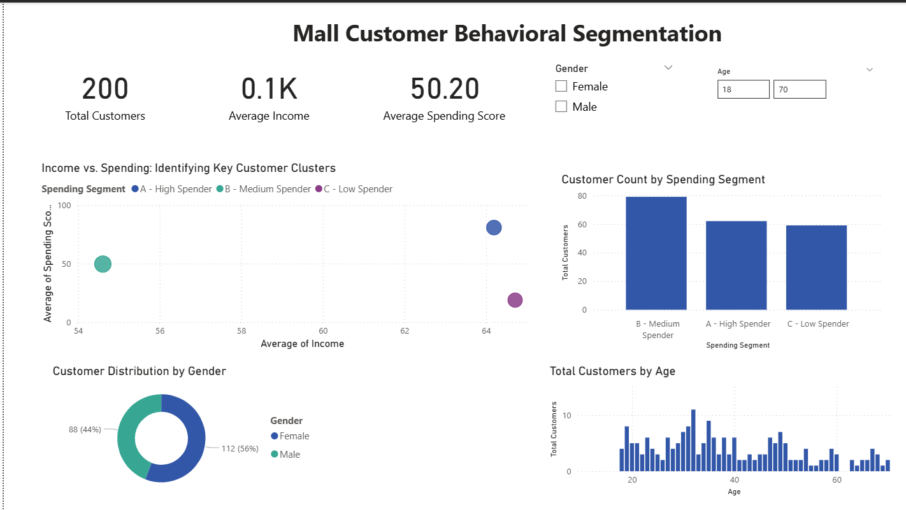

# PowerBI-Mall-Customer-Segmentation
A Power BI dashboard analyzing customer demographics and spending habits for a retail mall
# 🏆 Mall Customer Behavioral Segmentation Dashboard (Power BI)

## 1. Project Overview & Goal 🎯

This project focuses on **Customer Segmentation** for a retail mall to identify key customer profiles based on their demographics and spending habits.

The primary goal of this dashboard is to visually cluster customers and provide actionable insights that marketing teams can use to create **targeted advertising campaigns** (e.g., maximizing profit from high-spenders or re-engaging low-spenders).

## 2. Dashboard Snapshot

A quick look at the final Power BI dashboard:

## 3. Key Business Insights 💡

The analysis, driven by the **Income vs. Spending Score** scatter plot, revealed three distinct customer clusters:

1.  **High-Value Spenders:** Customers with **Low-to-Moderate Annual Income** but the **Highest Spending Scores** (the most profitable group).
    * *Recommendation:* Launch an exclusive, personalized loyalty program to ensure retention.
2.  **High-Potential Earners:** Customers with the **Highest Annual Income** but **Low Spending Scores**.
    * *Recommendation:* Target these customers with premium product offerings and luxury services to capture their high earning potential.
3.  **Budget-Conscious:** The largest group, defined by **Low Income** and **Low Spending Scores**.
    * *Recommendation:* Utilize seasonal sales and bundle promotions to drive purchase volume from this large segment.

## 4. Technical Skills Demonstrated 🛠️

This project showcases proficiency in the following tools and techniques:

* **Tool:** Power BI (Data Visualization, Reporting)
* **Data Preparation:** Cleaning and transforming data within Power Query.
* **DAX:** Creating simple yet effective **Calculated Columns** (`Spending Segment`) and **Measures** (`Total Customers`, `Average Spending Score`).
* **Visualization:** Advanced use of the **Scatter Plot** for multivariate segmentation analysis.
* **Dashboard Design:** Implementing a clean, single-page, and interactive design with slicers for dynamic filtering.

## 5. Files Included

* `Mall_Segmentation_Dashboard.pbix`: The complete Power BI project file.
* `Mall_Customers.csv`: The original data used for the analysis.
* `Final_Dashboard_Image.png`: High-resolution screenshot of the final dashboard.
